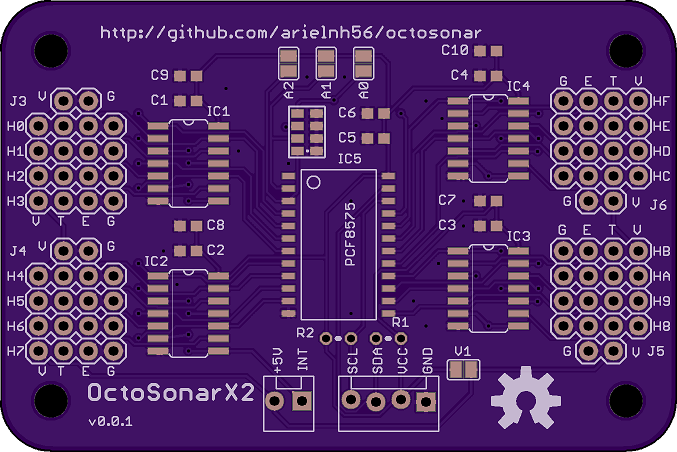

This is 1.0.0 batch.

It differs from the 0.0.1 prototype with changes in bypass caps and a re-routing
of the power around the board with a wider track. This now runs closer than
ideal to the bottom left mounting hole so I ship a plastic screw with it.
That should be fixed in the next batch.
